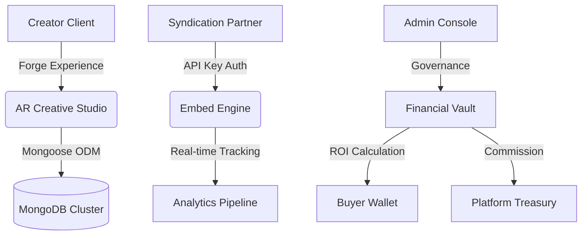

# Adgyapan: High-Depth AR Advertising & Syndication Network

Adgyapan is an enterprise-grade, performance-based augmented reality (AR) advertising platform. It enables creators to forge immersive 3D experiences and syndicators to distribute them across global partner networks through a secure, ROI-driven financial ecosystem.

---

## 🏗 System Architecture

Adgyapan is built on a high-availability stack designed for sub-second AR delivery and cryptographically secure financial operations.



### Technical Core
- **AR Delivery Engine**: Built on **MindAR** and **A-Frame** for cross-device marker tracking and 3D scene rendering.
- **Financial Vault**: A proprietary transaction ledger handling Escrow-style bidding and ROI distribution.
- **Identity Layer**: Integrated with **Clerk** for enterprise-level multi-tenant authentication.

---

## 🎨 AR Creative Studio (The Depth Engine)

Adgyapan moves beyond static overlays by injecting interactive 3D behaviors directly into the viewport.

### 1. Interaction Behaviors
Mapped via the `ARBehavior` component, ads utilize physics-based animations:
| Behavior | Technical Description | Use Case |
| :--- | :--- | :--- |
| **Sine-Wave Float** | Oscillates in Y-axis using `Math.sin()` logic. | Premium product showcases. |
| **Breathing Pulse** | Smooth scale transitions (0.95x to 1.05x). | Attention-grabbing "Hot Deals". |
| **Digital Glitch** | Random spatial jitter (30ms intervals) via `tick()` handlers. | High-tech/Cyberpunk branding. |

### 2. Physical Rendering Presets
Visual frames are rendered using advanced CSS `backdrop-filter` and A-Frame custom materials:
- **Frosted Glass**: 20px Gaussian blur with specular highlights.
- **Cyber Neon**: Emissive borders with active glow buffers.
- **Frost Bite**: High-roughness textures with custom opacity mapping.

---

## 💰 The Financial Vault Protocol

The "Vault" is the heart of the Adgyapan ecosystem, ensuring every view translates into revenue.

### 1. ROI Multiplication Formula
Unlike traditional CPM models, Adgyapan uses a performance multiplier:
$$\text{Buyer Earnings} = \left( \frac{\text{Total Bid}}{\text{Target Views}} \right) \times 1.5$$
- **Net Profit**: Successful campaign delivery results in a **50% net profit** for the buyer.
- **Quota Lockdown**: The API automatically terminates embed keys once `viewCount >= targetViews`.

### 2. Platform Revenue (Treasury)
Adgyapan operates on a decentralized-ready commission model:
- **Seller Share**: 85% of accepted bid amount.
- **Treasury Tax**: 15% automatically diverted to `ADGYAPAN_OFFICIAL` for platform maintenance and burn.

---

## 📡 Syndication & Tracking API

Ads are served via a highly optimized `<iframe />` embed system that requires cryptographic authentication.

### Secure Embed Protocol
Embeds are unique to the syndication partner's API Key and Campaign PIN.
```html
<iframe 
  src="https://adgyapan.vercel.app/embed?apiKey=YOUR_KEY&pin=CAMPAIGN_PIN" 
  width="600" 
  height="400" 
  frameborder="0" 
  allow="camera; accelerometer;"
></iframe>
```

### Event Tracking Matrix
| Event Type | Logic | Impact |
| :--- | :--- | :--- |
| `scenetime` | 10-second heartbeat pings. | Analytics profiling. |
| `lead` | Capture via JSON Schema forms. | Buyer CRM integration. |
| `ar_scan` | Scan-to-Mobile QR redirection. | Cross-device conversion. |

---

## 🏗 Setup & Installation

### Environment Configuration
Create a `.env.local` with the following enterprise parameters:

```bash
# Database
MONGODB_URI="mongodb+srv://..."

# Authentication (Clerk)
NEXT_PUBLIC_CLERK_PUBLISHABLE_KEY="pk_..."
CLERK_SECRET_KEY="sk_..."

# Asset Management
CLOUDINARY_CLOUD_NAME="..."
CLOUDINARY_API_KEY="..."
CLOUDINARY_API_SECRET="..."
```

### Installation
```bash
npm install
npm run dev
```

---

## � Operational Governance (Admin Console)

Adgyapan includes a robust governance layer for platform administrators:
- **KYC Verification**: Manual review of user identity documents for high-volume transactions.
- **Withdrawal Clearing**: Multi-signature-ready request handling for funds leaving the ecosystem.
- **Global Broadcast**: System-wide notifications sent via the `admin/mark-read.js` heartbeat.

---

## ⚖️ License & Contributions

Adgyapan is a proprietary platform. Contributions follow the internal security guidelines of the engineering team.

*Authored by the Adgyapan Engineering Team. Inspired by the performance standards of Google and Meta.*
